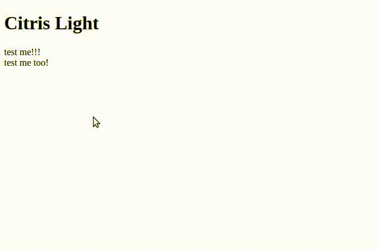

# Citrius light

ES2015 module for shining spotlight on UI element.



_typo in gif, but whatever_

## Usage

### Basic
```js
// script.js
import { citruslight } from 'citruslight'

(() => {
  // get a reference to the target DOM element
  const el = document.getElementById('important-element')
  
  // highlight the said element
  const dismissCb = citruslight(el)

  // dismiss the highlight after 2s
  setTimeout(() => {
    dismissCb()
  }, 2000)
})()

```

```html
<!-- index.html -->

<!-- truncated for brevity -->
<h1>Title</h1>
  <span id="important-element">hello world</span>
  <i id="other-things">Other things</i>
  <script type="module" src="script.js"></script>
<!-- truncated for brevity -->
```

### Dismiss on click

```js

import { citruslight } from 'citruslight'

(() => {

  let cb
  
  // get a reference to the target DOM element
  const el = document.getElementById('important-element')
  
  // highlight the said element
  cb = citruslight(el, {
    eventHandlers: [{
      name: 'click',
      handler: () => {
        if (cb) cb()
      }
    }]
  })
})()

```

### Custom width/height

```js

import { citruslight } from 'citruslight'

(() => {
  
  // get a reference to the target DOM element
  const el = document.getElementById('important-element')
  
  // highlight the said element with width 50px height 50px
  citruslight(el, {
    width: 50,   // px
    height: 50,  // px
  })
})()
```

### Custom location

```js

import { citruslight } from 'citruslight'

(() => {
  
  // highlight the said element with width 50px height 50px
  citruslight(null, {
    center: {
      x: 150,
      y: 150,
    },
    width: 50,   // px
    height: 50,  // px
  })
})()
```

## License

MIT